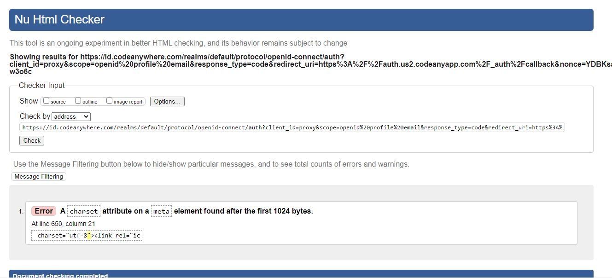

# FemmeFit

FemmeFit is a website that hopes to entice women to feel confident starting, or continuing, their fitness journey in FemmeFit's state-of-the-art all female gym and fitness centre. The site is targetted at women of all fitness abilities who are hoping to join a female only gym. The FemmeFit website will be helpful for women to learn about the services offered at FemmeFit gym.

[image of Responsivee Mockup]

## Existing Features

### Navigation Bar

The navigation bar is present on all three webpages and includes links to Home, About, and Pricing. This navigation bar is identical across each webpage. The navigation bar allows users to navigate through each page without having to use the 'back' button.

### The Landing Section image

The landing includes a photograph with a logo overlay to allow the user to become aware of FemmeFit logo
This section introduces the user to FemmeFit with a sleek photo of women exercising at the premises. 

### About Section

The About section allows the user to gain a better understanding of the gym's origin and standing as a female operated gym. It discusses some of the classes and services that are available and emphasises the strong sense of community that the gym endeavours to offer. 

### Pricing section

This section will allow the user to see the different types of payment plans available to them when wishing to attend the gym. 

### Contact Us section

Provides the user with contact information to get in touch with gym. Also provides an embedded map indicating location of gym. 

### Sign Up Now section

Provides the user with a basic contact form to submit their interest in signing up for the gym. This section includes a name, e-mail, and message field. 

### The Footer

The footer section includes links to the relevant social media sites for FemmeFit. The links will open to a new tab to allow easy navigation for the user.
The footer is valuable to the user as it encourages them to keep connected via social media

## Features Left to Implement
- A gallery of gym members participating in classes and attending the gym. 
- A testimonials page with reviews from current and past members
- A page detailing classes on offer 

## Testing/Validator Testing

- I tested the website in multiple browsers - Firefox, Edge, Chrome (site successful in each)
- I ensured project was responsive in different screen sizes using Chrome Dev Tools - the site displayed on multiple screen sizes generally well without major responsivity issues. 
- I confirmed that the Navigation bar is functioning and directs the user to the correct pages without issue. 

### HTML
One error was returned when passing through the official W3C validator regarding the charset UTF-8, please see image: 

### CSS
No errors were found when passing through the official (Jigsaw) validator - please see link [here](https://jigsaw.w3.org/css-validator/validator?uri=https%3A%2F%2F8000-megc92-v2personal-traini-5iv6y06879.us2.codeanyapp.com%2F&profile=css3svg&usermedium=all&warning=1&vextwarning=&lang=en#css)

## Unfixed Bugs
HTML Validator error RE: charset UTF-8 remains unfixed as unsure what is wrong with this and does not appear to impact functionality of website. 

## Deployment

The site was deployed to GitHub pages. The steps to deploy are as follows:
1. On the GitHub repository, navigate to the Settings tab
2. On lefthand side of page - navigate to Pages
3. The source was set to 'Deploy from a branch' 
4. Once selected, the 'main' branch was then selected and saved 
5. The live link can be found here - https://code-institute-org.github.io/love-running-2.0/index.html

## Credits

### Content & Media
- The filler text for each of the webpages was was generated by ChatGBT
- Instructions on how to use and implement FlexBox for layouts was taken  from a [W3 Schools Tutorial](https://www.w3schools.com/css/css3_flexbox.asp)
- The fonts for the website were imported from Google Fonts
- The color pallette was chosen using ColorSpace however chose to primarily use one color 
- The icons in the footer were taken from Font Awesome Media
- The photos used across the website were downloaded from Unsplash
- I made the FemmeFit logo in Photoshop 
